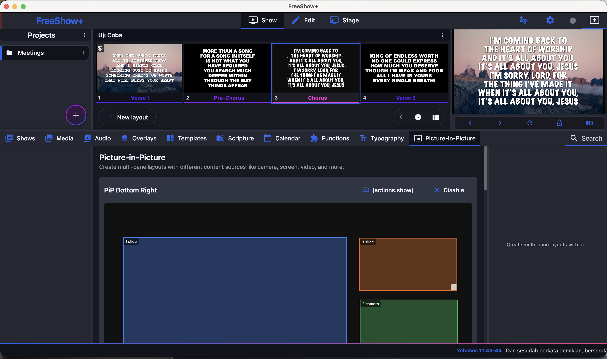
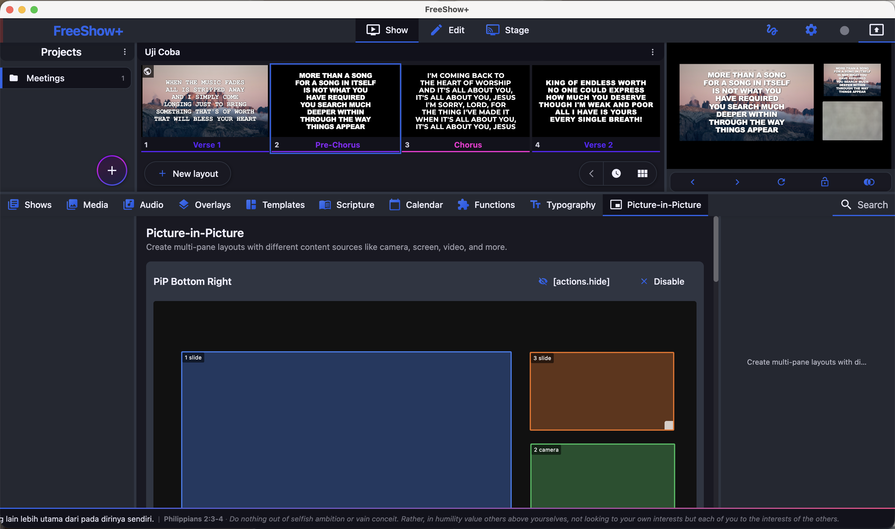
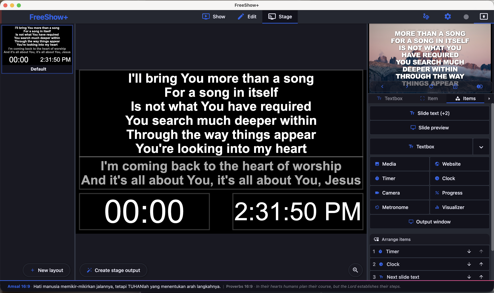
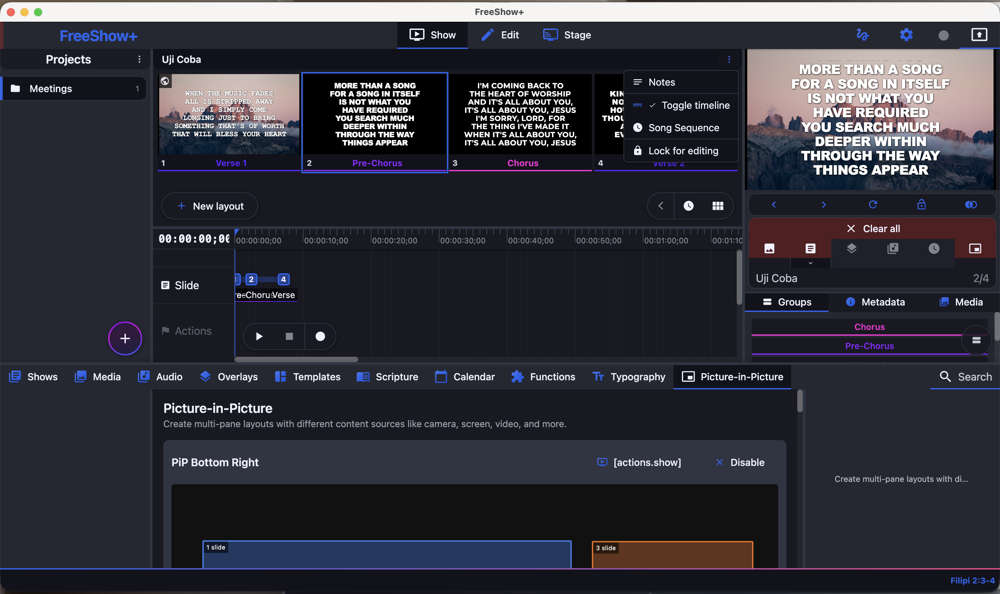
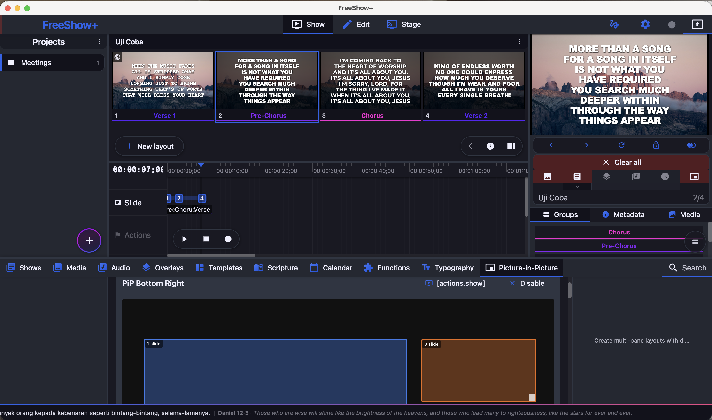
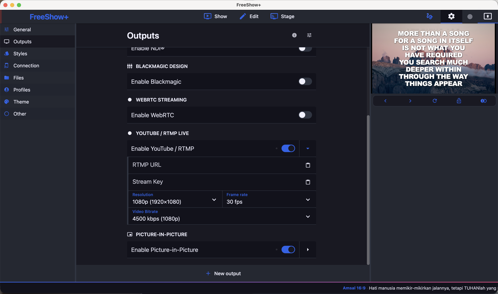

  <h1>FreeShow+</h1>

<h1 align='center'>
  FreeShow+
</h1>

  FreeShow+ adalah fork dari FreeShow — aplikasi presentasi ibadah gratis berbasis open-source, dilengkapi fitur tambahan untuk gereja Indonesia.

  
  &nbsp;
  
  &nbsp;
  

 

## Fitur Tambahan FreeShow+

- **230+ Ayat Alkitab Bilingual** (TB + NIV) tampil di splash screen & footer bar
- **Running text ayat** di footer — berjalan pelan, otomatis ganti setiap ayat selesai
- **Rotasi ayat otomatis** setiap 1 jam di splash screen
- **Tombol Start/Stop YouTube Stream** langsung di toolbar atas — tanpa masuk Settings
- **PiP (Picture-in-Picture)** — background slide tampil benar di mode multi-pane
- **Animasi teks & preset tipografi custom**

## Download

Unduh installer terbaru di halaman [Releases](https://github.com/canayadita/FreeShow/releases):

| Platform | File |
|----------|------|
| Windows | `ProShow-x.x.x-x64.exe` |
| macOS Intel | `ProShow-x.x.x-x64.dmg` |
| macOS Apple Silicon | `ProShow-x.x.x-arm64.dmg` |
| Linux | `ProShow-x.x.x-x86_64.AppImage` |

> **Windows**: Saat install mungkin muncul peringatan SmartScreen. Klik **More info → Run anyway**.

## Get Started Using FreeShow

## Preview

<table>
  <tr>
    <td width="50%"> <b>Picture-in-Picture</b> — lyrics + live camera in one output</td>
    <td width="50%"> <b>PiP editor</b> — drag & resize panes, mix slide / camera / screen</td>
  </tr>
  <tr>
    <td width="50%"> <b>Stage monitor</b> — current & next slide preview, clock & timer</td>
    <td width="50%"> <b>Song Sequence</b> — MP3 lyric-timecode automation</td>
  </tr>
  <tr>
    <td width="50%"> <b>Slide timeline</b> — record & play back slide timing</td>
    <td width="50%"> <b>YouTube / RTMP live streaming</b> — built in</td>
  </tr>
</table>

## Tentang FreeShow (Base App)

FreeShow adalah program presentasi gratis dan open-source yang memudahkan menampilkan teks di layar besar. Mendukung stage display, remote control, media, dan banyak fitur canggih lainnya.

FreeShow+ adalah fork yang dikembangkan dengan tambahan fitur khusus untuk kebutuhan ibadah dan pelayanan gereja di Indonesia.

## Terbuka untuk FreeShow (Upstream) / Open to Upstream

🇮🇩 Repo ini **publik dan berlisensi GPL-3.0**. Kami sangat menghormati karya [FreeShow](https://github.com/ChurchApps/FreeShow) — fork ini ada karena itu. Fitur apa pun di sini (mis. animasi teks, timecode lirik dari MP3, PiP) **silakan diambil langsung ke FreeShow** bila berguna. Riwayat commit terbuka, dan sebagian besar dikembangkan **dengan bantuan AI** (commit mencantumkan `Co-Authored-By: Claude`) — kami terbuka penuh soal ini. Dengan senang hati kami tunjukkan commit tertentu bila membantu.

🇬🇧 This repo is **public and GPL-3.0 licensed**. We deeply respect [FreeShow](https://github.com/ChurchApps/FreeShow) — this fork only exists because of it. Feel free to take **any feature here straight into FreeShow** if it's useful (e.g. text animations, the MP3 lyric-timecode, PiP). The commit history is open, and much of it was **AI-assisted** (commits credit `Co-Authored-By: Claude`) — we're fully transparent about that. Happy to point to specific commits if helpful.

## Bantuan & Kontribusi

1. Clone repo ini
2. Install [Node.js](https://nodejs.org/en/download/)
3. Install [Python 3.12](https://www.python.org/downloads/) dan package [`setuptools`](https://pypi.org/project/setuptools/)
4. Di Windows: install [Visual Studio](https://visualstudio.microsoft.com/downloads/) dengan "Desktop development with C++" + Windows 10 SDK
5. Di Linux: `sudo apt-get install libfontconfig1-dev`
6. Jalankan: `npm install`
7. Start app: `npm start`

## Lisensi

GPL-3.0 — Fork dari [FreeShow](https://github.com/ChurchApps/FreeShow) oleh ChurchApps.
